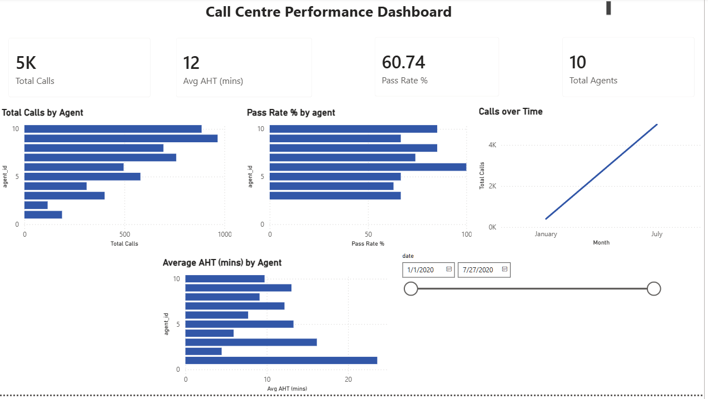

# Call Centre Performance Dashboard

## Project Overview
End-to-end data analysis project analysing call centre performance 
across 10 agents, 3 products and 2 languages over 7 months (Jan–Jul 2020).
The goal was to uncover insights on agent performance, call volume trends 
and quality pass rates to help management make data-driven decisions.

---

## Tools & Technologies
- **Python (Google Colab)** — Exploratory Data Analysis & data cleaning
- **MySQL Workbench** — Data transformation & KPI aggregation using SQL
- **Power BI** — Interactive dashboard & KPI visualisation
- **GitHub** — Version control & project publishing

---

## Dataset
270 records of call centre operational data containing:

| Column | Description |
|--------|-------------|
| agent_id | Unique identifier for each agent (1–10) |
| date | Date of the record (Jan–Jul 2020) |
| product_id | Product handled (1–3) |
| lang_id | Language of the call (1–2) |
| calls_handled | Number of calls handled that day |
| avg_aht | Average Handle Time in seconds |
| std_pass | Quality standard pass (1) or fail (0) |
| low_aht_flag | Flagged calls with suspiciously low AHT |

---

## Project Steps

### 1. EDA & Data Cleaning (Python)
- Loaded semicolon-separated CSV using pandas
- Fixed European number format on avg_aht (e.g. 1.325,75 → 1325.75)
- Converted date column from string to datetime
- Checked for missing values (none found) and duplicates (none found)
- Flagged 2 suspicious records with AHT under 10 seconds
- Exported clean dataset as callcenter_clean.csv

### 2. SQL Analysis (MySQL Workbench)
- Created callcentre database and imported clean CSV
- Wrote 10 queries covering:
  - Overall KPI summary
  - Performance by agent, product and language
  - Monthly call volume trends
  - Top 3 and bottom 3 performing agents
  - Peak call days
  - Full agent performance summary including suspicious calls

### 3. Power BI Dashboard
- Loaded clean CSV into Power BI Desktop
- Fixed data types in Power Query
- Created 4 DAX measures: Total Calls, Avg AHT (mins), Pass Rate %, Total Agents
- Built interactive dashboard with:
  - 4 KPI cards
  - Total Calls by Agent (bar chart)
  - Pass Rate % by Agent (bar chart)
  - Avg AHT by Agent (bar chart)
  - Call Volume over Time (line chart)
  - Date slicer for interactive filtering

---

## Key Findings
- **5,400 total calls** handled across 7 months
- **Average Handle Time: 11.52 minutes** per call
- **Overall Pass Rate: 60.74%** — below industry standard of 80%+
- **Agent 9 & 10** carried the highest workload
- **Agent 2** flagged as performance risk — lowest call volume, 
  suspicious AHT values and high fail rate
- **Call volume grew steadily** from January to July 2020
- **Product 3** consistently showed lower AHT than other products

---

## Dashboard Preview

---

## Files in this Repository

| File | Description |
|------|-------------|
| call_centre_data_analysis&cleaning.ipynb | Python EDA & cleaning notebook |
| call_centre_analysis.sql | All 10 SQL queries |
| call_centre_dashboard.pbit | Power BI dashboard template |
| call_centre_performance_dashboard.png | Dashboard screenshot |
| README.md | Project documentation |

---

## How to Run This Project
1. Open `call_centre_data_analysis&cleaning.ipynb` in Google Colab
2. Upload your dataset and run all cells
3. Import `callcenter_clean.csv` into MySQL Workbench
4. Run queries from `call_centre_analysis.sql`
5. Open `call_centre_dashboard.pbit` in Power BI Desktop

---

## Author
**Naomi Sirya**  
GitHub: [umiSirya](https://github.com/umiSirya/callcentre_performance)
